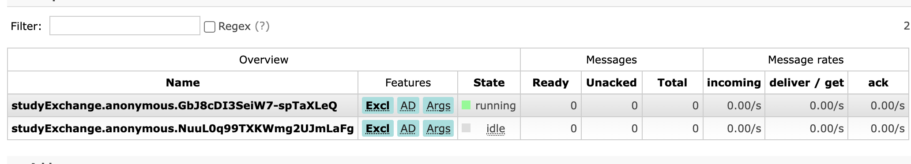
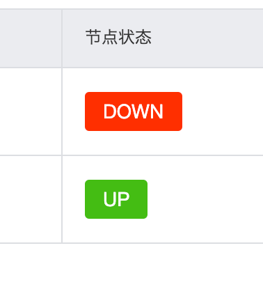
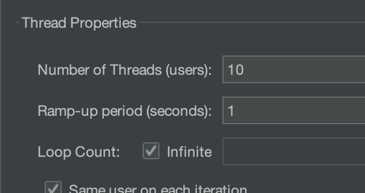
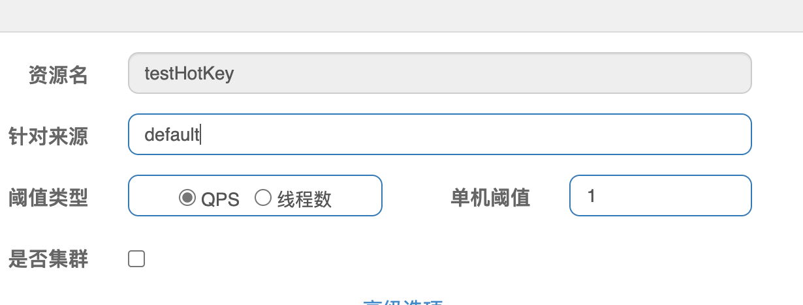

# 数据库

```shell
docker pull mysql:8.0.28
docker run -d --name sgg-springcloud-mysql -p 3306:3306 -e MYSQL_ROOT_PASSWORD=123456 mysql:8.0.28
```


```mysql
create database db2019 DEFAULT CHARSET utf8 COLLATE utf8_general_ci;

use db2019;
create table `payment`(
    `id` bigint(20) not null auto_increment,
    `serial` varchar(200) default  '',
    primary key (`id`)
) engine=innodb auto_increment=1 default charset utf8;

insert into payment (id, serial) values (31,'尚硅谷001');
select * from payment;
```

# P21
## 无法访问http://eureka7002.com:7002/eureka/

别忘了修改host，以及别忘了修改` register-with-eureka: true`参数

以及先开eureka再启动

# P22

## unknownhost异常
1. 此时在cloud-provider-payment8001/8002 先把`@EnableDiscoveryClient`注解关了
2. 在`cloud-consumer-order80`工程里，先把`spring-cloud-starter-zipkin`这个依赖关了，否则找不到服务。

tmd补充，我发现又发现，即使不改也能得到结果。奇了怪了。
补充 应该是有延时

# p28

```shell
docker pull zookeeper:3.4.14
docker run -d -e TZ="Asia/Shanghai" -p 2181:2181 --name zookeeper3.4.14 --restart always zookeeper:3.4.14
```

视频之中说的jar包冲突是因为：报了unimplement异常，说明这个jar包不对，那就换成3.4.x版本的jar

服务注册成功之后，登陆进去看一下
```shell
/zookeeper-3.4.14/bin/zkCli.sh

ls /services/cloud-provider-payment
get /services/cloud-provider-payment/xxxxxx
```

# p32

```shell
docker run -d -p 8500:8500 --restart=always --name consul:1.6.10 consul:1.6.10 agent -server -bootstrap -ui -node=1 -client='0.0.0.0'

docker run --name consul1.6.10 -d -p 8500:8500 -p 8300:8300 -p 8301:8301 -p 8302:8302 -p 8600:8600 consul:1.6.10 agent -server -bootstrap-expect=1 -ui -bind=0.0.0.0 -client=0.0.0.0
```
登陆进去不用执行`consul agent -dev`

# p36
- 集中式LB：nginx 例如外部来了http请求，nginx负责分发到不同的机器上；
- 进程式LB：ribbon 在程序内做rpc调用的时候，将这个调用分发到不同微服务上。
- LB：其实都是LB，只不过用的地方不一样，前者面向外部，后者是服务内部各个微服务之间的调用

# p38
`RibbonClient`这个注解源码有清晰的注释；

# p42
此时首先要把`restTemplate`的`loadBalance`注解关了，这节的意义在于手动地实现负载均衡；当然= =此时`http://localhost:80/consumer/payment/get/31` 就失效了

# p47
问题：由于微服务是拆分的，拆分导致了复杂的依赖关系；如果某个服务S被多个服务直接依赖或者间接依赖，当服务S出现了问题，所有依赖这个服务的服务都会受到影响，例如调用超时、调用线程持续等待，就雪崩了；

# p51


jmeter配置图


此实验先把`@EnableCircuitBreaker`给注释掉


# P51

这一节的例子是模拟8001背压垮，然后消费端80调用ok接口受到影响；记得把`PaymentHystrixService`的`fallback = PaymentFallbackService.class`注释掉；并且把`EnableHystrix`注释了


# p53

这块服务降级主要是为了不要再访问这个服务了，防止多个线程因为这个坏节点而卡死，防止雪崩，保护服务器；


# p54


在下面的配置里，

```java
@HystrixCommand(fallbackMethod = "paymentInfo_TimeOutHandler",commandProperties = {
            @HystrixProperty(name="execution.isolation.thread.timeoutInMilliseconds",value="3000")
    })
    public String paymentInfo_TimeOut(Integer id)
    {
        //int age = 10/0;
        try { TimeUnit.MILLISECONDS.sleep(5000); } catch (InterruptedException e) { e.printStackTrace(); }
        return "线程池:  "+Thread.currentThread().getName()+" id:  "+id+"\t"+"O(∩_∩)O哈哈~"+"  耗时(秒): ";
    }
```

执行时会走进`catch`阶段，然后会报下一个异常。说明实现也是用中断来中止线程的。

```java
java.lang.InterruptedException: sleep interrupted
	at java.lang.Thread.sleep(Native Method)
```


# P55

视频中说了支付侧降级还是订单侧降级，实际上无论放在哪里，降级指的都是一个微服务，当某个接口在内部发生异常的时候，直接返回一些默认的结果，例如fallback；放在订单侧，就是订单侧返回异常，放在支付侧，就是支付侧返回异常。


# P57

这块使用了`FeignClient`的`fallback`，这块处理失败的逻辑应该是与ribbon的失败规则相同。因为调用time接口时，超过1s就会报错；


# P62
图里的construct和run我理解应该是真实的服务方法，就是例子里的service方法，例如`paymentCircuitBreaker`


# p64

`[Hystrix Dashboard](http://127.0.0.1:9001/hystrix)`


# P66

网关位于nginx后面，我个人理解，就是将不同的请求，根据请求的路径等规则，发送到不同的微服务身上；nginx不关注业务，关注负载均衡；而网关关注这个请求到底需要发送到哪个微服务上；


# p68

- predicate：用于判断是否匹配，匹配才会转发；
- filter：对一些匹配的、要转发的请求进行一些特定的过滤、一些pre；


# p71

通过这一节可以印证，gateway需要实现路由功能，也就是分发，将这次请求根据路由规则，分发到对应的微服务身上；以openfeign为例，调用方调用微服务的时候，是根据对方的服务名，调起相应的服务，但在gateway里，相当于将各个微服务都注册到这个网关上，调用方的所有的请求都与网关交互，网关根据路由规则，将这个请求自动地发送到对应的微服务，相当于gateway就是维护了调用微服务的规则。

对比nginx，nginx做的就仅仅是负载均衡轮询分发。


# P74


```shell
docker pull rabbitmq:3.4.3-management
docker run -d --name sgg-cloud-rabbitmq -p 5672:5672 -p 15672:15672 --hostname sggCloudRabbit rabbitmq:3.4.3-management
```


# P75

访问地址`[localhost:3344/config-prod.yml](http://localhost:3344/config-prod.yml)`就可以直接访问得到，因为如下配置已经写好了，上述网址会自动在这个git下的label指定的分支，并且在`atguigu2020/spring-cloud-config`这个路径之下进行搜索`config-prod.yml`这个文件；

```yml
server:
        git:
          uri: https://github.com/dominic-z/hello-spring-cloud.git #GitHub上面的git仓库名字
        ####搜索目录
          search-paths:
            - atguigu2020/spring-cloud-config
      ####读取分支
      label: learn/20220130-sgg-spring-cloud
```

当然`[localhost:3344/atguigu2020/spring-cloud-config/master/config-prod.yml](http://localhost:3344/atguigu2020/spring-cloud-config/master/config-prod.yml)`这个路径也能访问到，但是呢可以看得出来，这种访问方式，对于分支里带`/`的，不是很友好，可能根本访问不到。


# P76

bootstrap优先级更高，p76的4分04秒的视频里的文字有两者的区别；


# P77

post to `localhost:3355/actuator/refresh`


# p78

可以登录`[RabbitMQ Management](http://localhost:15672/#/exchanges)`就可以看到一个`springCloudBus`的exchange

老师用的是3.7，不过无所谓，大差不差


# P81

Post `http://localhost:3344/actuator/bus-refresh`


# P82


# P87

下面的配置是是说，`output`这个binding（绑定关系）绑定在`defaultRabbit`这个Rabbit上

```yml
stream:
        binders: # 在此处配置要绑定的rabbitmq的服务信息；
          defaultRabbit: # 表示定义的名称，用于于binding整合
            type: rabbit # 消息组件类型
            environment: # 设置rabbitmq的相关的环境配置
              spring:
                rabbitmq:
                  host: localhost
                  port: 5672
                  username: guest
                  password: guest
        bindings: # 服务的整合处理
          output: # 这个名字是一个通道的名称
            destination: studyExchange # 表示要使用的Exchange名称定义
            content-type: application/json # 设置消息类型，本次为json，文本则设置“text/plain”
            binder: defaultRabbit # 设置要绑定的消息服务的具体设置
```


注入bean，下面这个bean是通过`@EnableBinding(Source.class)`这个注解激活的，之所以能注入，是因为配置里绑定关系的名称叫做`output`，并且

```java
@Resource
    private MessageChannel output; // 消息发送管道
```

`Source.class`这个类里刚好名称为output`

```java
public interface Source {
    String OUTPUT = "output";

    @Output("output")
    MessageChannel output();
}
```


# P89

视频里提到的组`group`，对应的概念就是rabbitMQ里的`Queue`，由于没指定`group`，因此两个消费者有各自的queue




# P91

视频里说的是如果没有group，这几个队列是非持久化的。


# P93


```shell
docker pull openzipkin/zipkin:2.12
docker run --name sgg-zipkin2.12 -d -p 9411:9411 openzipkin/zipkin:2.12
```


# P96


```shell
docker pull nacos/nacos-server:1.4.2

docker run -d -p 8848:8848 --env MODE=standalone  --name sgg-nacos1.4.2  nacos/nacos-server:1.4.2
```


# P101

亲测`file-extension: yml`也支持


# P107


## 使用独立的容器

创建独立的库表

```mys
create database nacos DEFAULT CHARSET utf8 COLLATE utf8_general_ci;
use nacos;
```


mysql的脚本：[nacos/nacos-mysql.sql at 1.4.2 · alibaba/nacos (github.com)](https://github.com/alibaba/nacos/blob/1.4.2/distribution/conf/nacos-mysql.sql)


### 先看看docker的网桥ip

使用命令`docker inspect bridge`，可以看到是`172.17.0.x`


### 找到docker本机的网桥ip

也就是说，如果某个容器要访问这个mysql，我的本机网桥ip为`172.17.0.1`，需要访问`172.17.0.1:3306`

就是个不同容器相互访问的桥梁

```json
{
                "Name": "springcloud-mysql",
                "EndpointID": "bc3cdc110b1b0d5d4eb767c9001b2dfaadb443ba3b7e308b9dbb450ec87ab158",
                "MacAddress": "02:42:ac:11:00:03",
                "IPv4Address": "172.17.0.3/16",
                "IPv6Address": ""
            }
```


### 创建容器


踩了个大坑：[Nacos Docker 快速开始](https://nacos.io/zh-cn/docs/quick-start-docker.html)这个网址上的容器参数，与https://github.com/nacos-group/nacos-docker上写的容器参数不同，举个例子，目前的容器已经用不到`MYSQL_MASTER_SERVICE_HOST`了，所以下面的配置有问题

```shell
docker run -d -p 8848:8848  --name sgg-mysql-nacos1.4.2  \
--link springcloud-mysql:mysql \
-e PREFER_HOST_MODE=hostname \
-e MODE=standalone  \
-e SPRING_DATASOURCE_PLATFORM=mysql \
-e MYSQL_MASTER_SERVICE_HOST=mysql \
-e MYSQL_MASTER_SERVICE_DB_NAME=nacos \
-e MYSQL_MASTER_SERVICE_PORT=3306 \
-e MYSQL_MASTER_SERVICE_USER=root \
-e MYSQL_MASTER_SERVICE_PASSWORD=123456 \
nacos/nacos-server:1.4.2 

```


需要改成

```shell
docker run -d -p 8848:8848  --name sgg-mysql-nacos1.4.2  \
-e MODE=standalone  \
-e MYSQL_DATABASE_NUM=1 \
-e SPRING_DATASOURCE_PLATFORM=mysql \
-e MYSQL_SERVICE_HOST=172.17.0.1 \
-e MYSQL_SERVICE_DB_NAME=nacos \
-e MYSQL_SERVICE_PORT=3306 \
-e MYSQL_SERVICE_USER=root \
-e MYSQL_SERVICE_PASSWORD=123456 \
nacos/nacos-server:1.4.2 
```


## 使用docker-compose

去他妈的还有bug，

```shell
git clone https://github.com/nacos-group/nacos-docker.git
cd nacos-docker

```

修改文件`standalone-mysql-8.yaml`

- 修改nacos-server版本
- 将文件夹里的custom.properties改成文件，否则会报文件夹挂载到文件上的错误；

```yml
version: "2"
services:
  nacos:
    image: nacos/nacos-server:1.4.2
    container_name: nacos-standalone-mysql
    env_file:
      - ../env/nacos-standlone-mysql.env
    volumes:
      - ./standalone-logs/:/home/nacos/logs
      - ./init.d/custom.properties:/home/nacos/init.d/custom.properties
    ports:
      - "8848:8848"
      - "9848:9848"
      - "9555:9555"
    depends_on:
      - mysql
    restart: always
  mysql:
    container_name: mysql
    image: nacos/nacos-mysql:8.0.16
    env_file:
      - ../env/mysql.env
    volumes:
      - ./mysql:/var/lib/mysql
    ports:
      - "3306:3306"
```


```shell
docker-compose -f example/standalone-mysql-8.yaml up
```


# P109


## 构造nacos

```shell
docker run -d -p 8846:8848  --name sgg-mysql-nacos1.4.2-cluster1  \
-e MODE=cluster  \
-e MYSQL_DATABASE_NUM=1 \
-e SPRING_DATASOURCE_PLATFORM=mysql \
-e MYSQL_SERVICE_HOST=172.17.0.1 \
-e MYSQL_SERVICE_DB_NAME=nacos \
-e MYSQL_SERVICE_PORT=3306 \
-e MYSQL_SERVICE_USER=root \
-e MYSQL_SERVICE_PASSWORD=123456 \
-e NACOS_SERVERS="172.17.0.1:8847" \
nacos/nacos-server:1.4.2 

docker run -d -p 8847:8848  --name sgg-mysql-nacos1.4.2-cluster2  \
-e MODE=cluster  \
-e MYSQL_DATABASE_NUM=1 \
-e SPRING_DATASOURCE_PLATFORM=mysql \
-e MYSQL_SERVICE_HOST=172.17.0.1 \
-e MYSQL_SERVICE_DB_NAME=nacos \
-e MYSQL_SERVICE_PORT=3306 \
-e MYSQL_SERVICE_USER=root \
-e MYSQL_SERVICE_PASSWORD=123456 \
-e NACOS_SERVERS="172.17.0.1:8846" \
nacos/nacos-server:1.4.2 
```


## 构造nginx


```shell
docker pull nginx:1.21.5
docker run -d --name sgg-springcloud-nacos-nginx -p 1111:1111 nginx:1.21.5
```


修改文档

```
apt-get update
apt-get install vim
```


拷贝文件`docker cp  ./nacos.conf sgg-springcloud-nacos-nginx:/etc/nginx/conf.d`

刷新nginx文件`nginx -s reload`


然后登陆`http://localhost:1111/nacos/`


但是偶尔会看到节点down掉，也不知道为什么，但是还能用，同时我发现，如果两者几乎同时启动，状态就是两个up了




# P112


```shell
docker pull bladex/sentinel-dashboard:1.4.2

docker run --name sgg-springcloud-sentinel  -d -p 8858:8858 -d  bladex/sentinel-dashboard:1.4.2
```

非官方的，唉直接去官网下载吧

- [Releases · alibaba/Sentinel (github.com)](https://github.com/alibaba/Sentinel/releases)
- [Sentinel · alibaba/spring-cloud-alibaba Wiki (github.com)](https://github.com/alibaba/spring-cloud-alibaba/wiki/Sentinel)

`java -jar sentinel-dashboard-1.7.1.jar`


# P117


这个实验要postman的runner进行高qps访问，或者直接上jmeter，只靠手点很难出现降级结果；


# P121

配置一个jmeter


记得打开无限循环压测，loop count 为infinit




# P124

`SentinelResource`注解的`value`指的是sentinel各个规则的一个名称；例如下图，就不用加`/`了




所谓热点key是说，如果第0个参数重复出现，例如`p1=1`，并且满足了qps的服务降级规则，那么下一次`p1=1`的请求就会被降级，但是同时，如果下一次请求没有`p1=1`这个参数，那么就不会降级。


# P125

小坑，get请求请求`http://localhost:8401/testHotKey?p1=1`的时候，由于是`GET`，因此类型一定得是String


# P126

唉postman不太适合压测，有点慢


# P136

`cloudalibaba-consumer-nacos-order84`的Feign上挂`fallbackHandler`，是相当于对`payment9003`服务的一个降级，并且这个降级的规则直接写在了order端，这个和`SentinelResource`有一些区别；

- `feign`的fallback是在调用侧进行降级，降级服务直接记录在调用侧，当调用侧发现服务侧失败，调用侧的feign直接使用降级服务作为结果返回；
- `SentinelResource`是定义在服务端提供方直接降级，如果服务端发现了自己被调用的时候异常，以一个降级的服务返回给调用方；


# P137


```json
[
	{
		"resource":"/rateLimit/byUrl",
		"limitApp":"default",
		"grade":1,
		"count":1,
		"strategy":0,
		"controlBehavior":0,
		"clusterMode":false
	}
]
```


