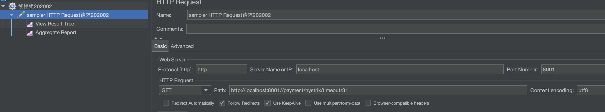

# 数据库

```mysql
create database db2019 DEFAULT CHARSET utf8 COLLATE utf8_general_ci;

use db2019;
create table `payment`(
    `id` bigint(20) not null auto_increment,
    `serial` varchar(200) default  '',
    primary key (`id`)
) engine=innodb auto_increment=1 default charset utf8;

insert into payment (id, serial) values (31,'尚硅谷001');
select * from payment;
```

# P21
## 无法访问http://eureka7002.com:7002/eureka/

别忘了修改host，以及别忘了修改` register-with-eureka: true`参数

以及先开eureka再启动

# P22

## unknownhost异常
1. 此时在cloud-provider-payment8001/8002 先把`@EnableDiscoveryClient`注解关了
2. 在`cloud-consumer-order80`工程里，先把`spring-cloud-starter-zipkin`这个依赖关了，否则找不到服务。

tmd补充，我发现又发现，即使不改也能得到结果。奇了怪了。
补充 应该是有延时

# p28

```shell
docker pull zookeeper:3.4.14
docker run -d -e TZ="Asia/Shanghai" -p 2181:2181 --name zookeeper3.4.14 --restart always zookeeper:3.4.14
```

视频之中说的jar包冲突是因为：报了unimplement异常，说明这个jar包不对，那就换成3.4.x版本的jar

服务注册成功之后，登陆进去看一下
```shell
/zookeeper-3.4.14/bin/zkCli.sh

ls /services/cloud-provider-payment
get /services/cloud-provider-payment/xxxxxx
```

# p32

```shell
docker run -d -p 8500:8500 --restart=always --name consul:1.6.10 consul:1.6.10 agent -server -bootstrap -ui -node=1 -client='0.0.0.0'

docker run --name consul1.6.10 -d -p 8500:8500 -p 8300:8300 -p 8301:8301 -p 8302:8302 -p 8600:8600 consul:1.6.10 agent -server -bootstrap-expect=1 -ui -bind=0.0.0.0 -client=0.0.0.0
```
登陆进去不用执行`consul agent -dev`

# p36
- 集中式LB：nginx 例如外部来了http请求，nginx负责分发到不同的机器上；
- 进程式LB：ribbon 在程序内做rpc调用的时候，将这个调用分发到不同微服务上。
- LB：其实都是LB，只不过用的地方不一样，前者面向外部，后者是服务内部各个微服务之间的调用

# p38
`RibbonClient`这个注解源码有清晰的注释；

# p42
此时首先要把`restTemplate`的`loadBalance`注解关了，这节的意义在于手动地实现负载均衡；当然= =此时`http://localhost:80/consumer/payment/get/31` 就失效了

# p47
问题：由于微服务是拆分的，拆分导致了复杂的依赖关系；如果某个服务S被多个服务直接依赖或者间接依赖，当服务S出现了问题，所有依赖这个服务的服务都会受到影响，例如调用超时、调用线程持续等待，就雪崩了；

# p51


jmeter配置图



此实验先把`@EnableCircuitBreaker`给注释掉


# P51

这一节的例子是模拟8001背压垮，然后消费端80调用ok接口受到影响；记得把`PaymentHystrixService`的`fallback = PaymentFallbackService.class`注释掉；并且把`EnableHystrix`注释了


# p53

这块服务降级主要是为了不要再访问这个服务了，防止多个线程因为这个坏节点而卡死，防止雪崩，保护服务器；


# p54


在下面的配置里，

```java
@HystrixCommand(fallbackMethod = "paymentInfo_TimeOutHandler",commandProperties = {
            @HystrixProperty(name="execution.isolation.thread.timeoutInMilliseconds",value="3000")
    })
    public String paymentInfo_TimeOut(Integer id)
    {
        //int age = 10/0;
        try { TimeUnit.MILLISECONDS.sleep(5000); } catch (InterruptedException e) { e.printStackTrace(); }
        return "线程池:  "+Thread.currentThread().getName()+" id:  "+id+"\t"+"O(∩_∩)O哈哈~"+"  耗时(秒): ";
    }
```

执行时会走进`catch`阶段，然后会报下一个异常。说明实现也是用中断来中止线程的。

```java
java.lang.InterruptedException: sleep interrupted
	at java.lang.Thread.sleep(Native Method)
```


# P55

视频中说了支付侧降级还是订单侧降级，实际上无论放在哪里，降级指的都是一个微服务，当某个接口在内部发生异常的时候，直接返回一些默认的结果，例如fallback；放在订单侧，就是订单侧返回异常，放在支付侧，就是支付侧返回异常。


# P57

这块使用了`FeignClient`的`fallback`，这块处理失败的逻辑应该是与ribbon的失败规则相同。因为调用time接口时，超过1s就会报错；
